  

> **CLASSIFIED OPERATION:** CYBER-PHYSICAL PRIVACY & ANTI-SURVEILLANCE  
> **STATUS:** PROTOTYPE DEPLOYED | **AUTHOR:** MR. CIPHER-X [C|THE]

 

### 🛡️ Operation Abstract

**Sentinel-X** is an advanced, IoT-based multi-modal security instrument engineered to detect covert surveillance devices and local network jamming. Powered by an **ESP32 Dual-Core architecture**, the system transitions beyond standard RF scanners by implementing a tri-modal detection strategy: High-gain **EMF Auditing** for offline recording bugs, Active **Infrared (IR) Retro-Reflection** for concealed optical lenses, and **Promiscuous Mode Packet Sniffing** to intercept IEEE 802.11 Deauthentication attacks in real-time.

---

### ⚙️ Cyber-Physical Architecture (Sensor Fusion Engine)

```mermaid
graph TD;
    A[ESP32 Dual-Core Microcontroller] -->|Analog ADC Oversampling| B(EMF Copper Spiral Antenna);
    A -->|PWM Signal 10Hz| C(Active IR LED Array);
    A -->|Promiscuous Mode Baseband| D(2.4GHz PCB Trace Antenna);
    B -->|Detects Voltage Fluctuations| E[Identify Offline Clock Oscillators];
    C -->|Cat's Eye Retro-Reflection| F[Illuminate Hidden Camera Lenses];
    D -->|Parse MAC Headers 0xC0/0xA0| G[Detect Deauth/Jamming Attacks];
    E --> H{Sensor Fusion Logic};
    F --> H;
    G --> H;
    H -->|I2C Protocol| I[Update SSD1306 OLED Dashboard];
    H -->|PWM Frequency Mod| J[Trigger Piezo Acoustic Alert];
    
    style A fill:#1a1a1a,stroke:#00FFFF,stroke-width:2px;
    style H fill:#1a1a1a,stroke:#8A2BE2,stroke-width:2px;
```

---

### 🧬 Threat Vector & Defense Matrix

| **Surveillance Threat** | **Hardware Detection Modality** | **System Action / Tactical Response** |
| :--- | :--- | :--- |
| **Offline Micro-SD Bugs** | EMF Auditing (High-Impedance 2.2MΩ) | Detects oscillator/switching noise; dynamic acoustic chirp guides user to the source. |
| **Pinhole Camera Lenses** | Active IR Optical Strobing (850nm/940nm) | Induces retro-reflective "glint" visible through a red-pass filter viewfinder. |
| **Wi-Fi Jamming (Deauth)** | 802.11 Management Frame Interception | Bypasses MAC filtering; counts malicious packets and triggers 4000Hz critical alarm. |

---

### 📸 Digital Evidence & Prototype Board

*(Note: Hardware schematics and localized EMF payload structures are restricted. The following displays the functional prototype and architectural flow.)*

  
  &nbsp; &nbsp;

---

  <code>[ OPERATION TERMINATED - SENTINEL ON STANDBY ]</code>

